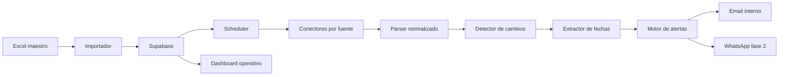

# Arquitectura Tecnica Ejecutable - Legal Search MVP

## 1. Objetivo del MVP

Construir un sistema piloto para automatizar la vigilancia judicial de procesos, priorizando la deteccion de terminos, audiencias y cambios relevantes a partir del numero de radicado.

El MVP no busca reemplazar toda la operacion de Legal Search. Busca reducir el riesgo operativo y el tiempo manual en el punto mas critico del negocio: saber que procesos tienen fechas, audiencias o cambios que requieren accion.

## 2. Alcance Inicial

### Incluido

- Registro centralizado de procesos judiciales.
- Carga inicial desde Excel.
- Consulta automatica por numero de radicado en fuentes publicas priorizadas.
- Almacenamiento historico de resultados consultados.
- Deteccion de cambios frente al ultimo estado conocido.
- Extraccion de fechas relevantes: audiencias, vencimientos, terminos y actuaciones con fecha.
- Generacion de alertas internas.
- Calendario operativo interno.
- Dashboard minimo para Fabio o el operador.
- Auditoria basica de consultas, errores y alertas generadas.

### Excluido del MVP

- Dashboard self-service para clientes.
- Descarga y analisis profundo de documentos.
- IA legal avanzada para interpretacion de providencias.
- Automatizacion completa de todas las jurisdicciones.
- Integracion WhatsApp como primer canal obligatorio.
- Firma electronica, gestion documental o CRM juridico.

## 3. Principio de Diseno

El sistema debe replicar primero el flujo manual validado, no inventar un flujo nuevo.

La unidad central del sistema es el radicado. A partir de ese identificador se consultan fuentes, se registran movimientos, se extraen fechas y se generan alertas.

## 4. Arquitectura General



## 5. Stack Propuesto

### Backend y datos

- Supabase Postgres como base de datos principal.
- Supabase Auth para usuarios internos en fase inicial.
- Supabase Edge Functions o jobs externos para consultas programadas.
- Storage opcional para snapshots HTML, PDFs o evidencias.

### Automatizacion

- Node.js/TypeScript para conectores y parsers.
- Playwright para fuentes que requieren navegador.
- Fetch/HTTP directo cuando la fuente lo permita.
- Cron jobs para ejecucion periodica.

### Frontend

- React/Vite o Next.js para dashboard interno.
- Tabla de procesos.
- Vista de alertas.
- Calendario operativo.
- Vista de historial por proceso.

### Notificaciones

- Fase 1: email operativo.
- Fase 2: WhatsApp mediante proveedor como Twilio, Wati, Zenvia o Meta Cloud API.

## 6. Modelo de Datos Supabase

### organizations

Representa Legal Search y, en el futuro, firmas cliente con usuarios propios.

Campos sugeridos:

- id uuid primary key
- name text not null
- created_at timestamptz default now()

### clients

Clientes finales o firmas a quienes se presta vigilancia.

Campos sugeridos:

- id uuid primary key
- organization_id uuid references organizations(id)
- name text not null
- client_type text check in ('individual', 'firm', 'company', 'insurer')
- email text
- phone text
- notification_preferences jsonb
- created_at timestamptz default now()

### cases

Proceso judicial vigilado.

Campos sugeridos:

- id uuid primary key
- organization_id uuid references organizations(id)
- client_id uuid references clients(id)
- radicado text not null
- normalized_radicado text not null
- court text
- jurisdiction text
- city text
- department text
- process_type text
- parties jsonb
- internal_owner text
- status text default 'active'
- priority text default 'normal'
- notes text
- created_at timestamptz default now()
- updated_at timestamptz default now()

Indices:

- unique(organization_id, normalized_radicado)
- index cases(client_id)
- index cases(status)

### sources

Fuentes judiciales o privadas consultadas.

Campos sugeridos:

- id uuid primary key
- name text not null
- source_type text check in ('public', 'private', 'manual')
- base_url text
- access_mode text check in ('http', 'browser', 'manual', 'api')
- has_captcha boolean default false
- is_active boolean default true
- notes text

### case_sources

Relacion entre proceso y fuente. No todos los procesos estan en todas las fuentes.

Campos sugeridos:

- id uuid primary key
- case_id uuid references cases(id)
- source_id uuid references sources(id)
- external_reference text
- last_checked_at timestamptz
- last_success_at timestamptz
- last_error_at timestamptz
- status text default 'pending'
- metadata jsonb

Indices:

- unique(case_id, source_id)
- index case_sources(status)
- index case_sources(last_checked_at)

### source_snapshots

Resultado crudo de cada consulta. Sirve para auditoria y reprocesamiento.

Campos sugeridos:

- id uuid primary key
- case_source_id uuid references case_sources(id)
- fetched_at timestamptz default now()
- fetch_status text check in ('success', 'error', 'blocked', 'not_found')
- raw_hash text
- raw_payload jsonb
- raw_html_path text
- error_message text
- duration_ms integer

Indices:

- index source_snapshots(case_source_id, fetched_at desc)
- index source_snapshots(raw_hash)

### case_movements

Actuaciones o movimientos normalizados detectados en una fuente.

Campos sugeridos:

- id uuid primary key
- case_id uuid references cases(id)
- source_id uuid references sources(id)
- snapshot_id uuid references source_snapshots(id)
- external_id text
- movement_date date
- title text
- description text
- movement_type text
- normalized_hash text not null
- metadata jsonb
- detected_at timestamptz default now()

Indices:

- unique(case_id, source_id, normalized_hash)
- index case_movements(case_id, movement_date desc)

### legal_events

Fechas juridicamente relevantes extraidas de movimientos o fuentes.

Campos sugeridos:

- id uuid primary key
- case_id uuid references cases(id)
- source_id uuid references sources(id)
- movement_id uuid references case_movements(id)
- event_type text check in ('audiencia', 'termino', 'vencimiento', 'actuacion', 'otro')
- event_date timestamptz not null
- end_date timestamptz
- title text not null
- description text
- confidence numeric default 1
- status text default 'active'
- change_status text default 'new'
- created_at timestamptz default now()
- updated_at timestamptz default now()

Indices:

- index legal_events(case_id, event_date)
- index legal_events(event_date)
- index legal_events(status)

### alerts

Alertas generadas por eventos o cambios.

Campos sugeridos:

- id uuid primary key
- organization_id uuid references organizations(id)
- client_id uuid references clients(id)
- case_id uuid references cases(id)
- legal_event_id uuid references legal_events(id)
- alert_type text check in ('new_event', 'event_changed', 'event_upcoming', 'source_error', 'manual_review')
- severity text check in ('low', 'medium', 'high', 'critical')
- title text not null
- message text not null
- status text default 'pending'
- due_at timestamptz
- created_at timestamptz default now()
- sent_at timestamptz
- acknowledged_at timestamptz

Indices:

- index alerts(status, due_at)
- index alerts(case_id)
- index alerts(client_id)

### notification_deliveries

Registro de envios por canal.

Campos sugeridos:

- id uuid primary key
- alert_id uuid references alerts(id)
- channel text check in ('email', 'whatsapp', 'internal')
- recipient text not null
- provider text
- provider_message_id text
- status text default 'pending'
- error_message text
- sent_at timestamptz
- delivered_at timestamptz
- created_at timestamptz default now()

## 7. Modulos del Sistema

### 7.1 Importador Excel

Responsabilidad:

- Recibir el cuadro maestro actual.
- Mapear columnas a clientes, procesos y fuentes.
- Normalizar radicados.
- Detectar duplicados.
- Crear registros iniciales.

Salida:

- cases
- clients
- case_sources

Reglas:

- Nunca sobrescribir datos manuales sin confirmacion.
- Guardar errores de importacion en un reporte.
- Permitir carga parcial.

### 7.2 Normalizador de Radicados

Responsabilidad:

- Limpiar espacios, guiones y caracteres inconsistentes.
- Generar normalized_radicado.
- Validar longitud y estructura esperada.

Ejemplo:

- Input: `11001-31-03-001-2023-00045-00`
- Normalizado: `11001310300120230004500`

### 7.3 Conectores por Fuente

Cada fuente debe implementarse como modulo independiente.

Interfaz esperada:

```ts
type SourceConnector = {
  sourceName: string;
  canHandle(input: CaseSourceInput): boolean;
  fetchCase(input: CaseSourceInput): Promise<SourceFetchResult>;
};
```

Resultado esperado:

```ts
type SourceFetchResult = {
  status: 'success' | 'error' | 'blocked' | 'not_found';
  rawPayload?: unknown;
  rawHtml?: string;
  fetchedAt: string;
  errorMessage?: string;
};
```

Fuentes candidatas:

- Rama Judicial Consulta de Procesos.
- SAMAI.
- CIUJ.
- Redelex, si Fabio entrega acceso o exportacion.
- Fuente manual, para eventos que Fabio registre durante el piloto.

### 7.4 Parser Normalizado

Responsabilidad:

- Convertir datos crudos de cada fuente en movimientos estandarizados.
- Extraer titulos, fechas, descripciones y referencias.
- Crear hash estable para evitar duplicados.

Interfaz esperada:

```ts
type ParsedMovement = {
  externalId?: string;
  movementDate?: string;
  title: string;
  description?: string;
  movementType?: string;
  normalizedHash: string;
  metadata?: Record<string, unknown>;
};
```

### 7.5 Detector de Cambios

Responsabilidad:

- Comparar movimientos parseados contra case_movements existentes.
- Insertar solo movimientos nuevos.
- Detectar modificaciones de eventos existentes.
- Generar alerta si el cambio es relevante.

Tipos de cambio:

- Nueva audiencia.
- Audiencia reprogramada.
- Audiencia cancelada.
- Nuevo termino.
- Nueva actuacion relevante.
- Fuente sin respuesta o bloqueada.

### 7.6 Extractor de Fechas Relevantes

Responsabilidad:

- Convertir movimientos en legal_events.
- Identificar patrones de audiencias y vencimientos.
- Clasificar evento.

Primera version:

- Reglas deterministicas por texto.
- Diccionario de palabras clave:
  - audiencia
  - diligencia
  - traslado
  - termino
  - vencimiento
  - fijacion
  - auto
  - sentencia

Fase posterior:

- Clasificador con IA para mejorar precision.
- Extraccion de fechas desde documentos.

### 7.7 Motor de Alertas

Responsabilidad:

- Crear alertas accionables para el operador.
- Evitar duplicados.
- Priorizar por severidad.

Reglas iniciales:

- Audiencia nueva: alerta high.
- Audiencia en proximos 7 dias: alerta high.
- Audiencia reprogramada: alerta critical.
- Termino en proximos 3 dias: alerta critical.
- Fuente bloqueada por mas de 24 horas: alerta medium.
- Proceso sin revision exitosa en mas de 48 horas: alerta high.

### 7.8 Dashboard Operativo

Pantallas minimas:

- Procesos activos.
- Alertas pendientes.
- Calendario de audiencias y terminos.
- Historial por proceso.
- Estado de fuentes.
- Errores de consulta.

No debe ser un portal comercial en el MVP. Debe ser una herramienta de operacion.

## 8. Flujo de Consulta Programada

1. Scheduler selecciona case_sources activos.
2. Prioriza procesos no consultados recientemente.
3. Ejecuta conector correspondiente.
4. Guarda source_snapshot.
5. Si la consulta falla, actualiza estado y genera alerta si aplica.
6. Si la consulta funciona, parsea movimientos.
7. Inserta movimientos nuevos.
8. Extrae legal_events.
9. Compara contra eventos previos.
10. Genera alertas.
11. Actualiza last_checked_at y last_success_at.

## 9. Frecuencia de Ejecucion

### Piloto

- Procesos criticos: cada 4 horas en dias habiles.
- Procesos normales: 1 vez al dia.
- Reintentos por error: cada 2 horas, maximo 3 intentos.

### Produccion

- Parametrizable por cliente, fuente y criticidad.
- Evitar abuso de fuentes publicas.
- Registrar tiempos, bloqueos y fallos por fuente.

## 10. Estrategia Anti-Fragilidad

Las fuentes judiciales pueden cambiar, caerse o bloquear automatizacion. Por eso el sistema debe asumir fallas como parte normal del proceso.

Medidas:

- Guardar snapshots crudos.
- Separar conectores de parsers.
- Registrar errores por fuente.
- Alertar cuando una fuente deja de responder.
- Mantener fallback manual.
- Evitar depender de una unica fuente.
- Implementar tests de parser con fixtures reales.

## 11. Seguridad y Cumplimiento

Datos sensibles:

- Radicados.
- Partes procesales.
- Datos de clientes.
- Historial judicial.
- Telefonos y correos.

Controles iniciales:

- Row Level Security en Supabase.
- Roles internos: admin, operador, lectura.
- Variables de entorno para credenciales.
- No guardar passwords de fuentes privadas en texto plano.
- Auditoria de acciones manuales.
- Backups programados.

## 12. Roadmap Tecnico por Hitos

### Hito 0 - Insumos

Duracion estimada: 2-3 dias.

Entregables:

- Excel maestro sin datos sensibles o con datos anonimizados.
- 10-20 radicados reales de prueba.
- Lista priorizada de fuentes.
- Logica actual de terminos explicada por Fabio.
- Ejemplos de notificaciones actuales.

Criterio de salida:

- Se puede reproducir manualmente el flujo de vigilancia para una muestra pequena.

### Hito 1 - Base de Datos e Importador

Duracion estimada: 3-5 dias.

Entregables:

- Proyecto Supabase.
- Tablas principales.
- Importador Excel.
- Normalizador de radicados.
- Carga de muestra piloto.

Criterio de salida:

- 20 procesos quedan registrados y asociados a clientes/fuentes.

### Hito 2 - Primer Conector Automatizado

Duracion estimada: 5-8 dias.

Entregables:

- Conector para una fuente publica prioritaria.
- Persistencia de snapshots.
- Parser inicial.
- Log de movimientos.

Criterio de salida:

- El sistema consulta al menos 10 radicados y guarda movimientos normalizados.

### Hito 3 - Eventos y Alertas

Duracion estimada: 5-8 dias.

Entregables:

- Extractor de audiencias y terminos.
- Tabla legal_events.
- Motor de alertas.
- Envio por email interno.
- Vista de alertas pendientes.

Criterio de salida:

- El sistema genera alertas accionables para fechas relevantes detectadas.

### Hito 4 - Piloto Operativo

Duracion estimada: 1-2 semanas.

Entregables:

- Carga de 50 procesos.
- Ejecucion diaria.
- Comparacion contra revision manual de Fabio.
- Medicion de precision.
- Ajustes de parsers y reglas.

Criterio de salida:

- Fabio puede usar el sistema como copiloto operativo sin abandonar su revision manual.

## 13. Metricas del Piloto

Metricas tecnicas:

- Porcentaje de consultas exitosas por fuente.
- Tiempo promedio por consulta.
- Cantidad de movimientos nuevos detectados.
- Cantidad de alertas generadas.
- Errores por fuente.
- Fuentes bloqueadas o inestables.

Metricas operativas:

- Horas manuales ahorradas.
- Audiencias detectadas automaticamente.
- Terminos detectados automaticamente.
- Falsos positivos.
- Falsos negativos.
- Alertas realmente utiles para Fabio.

Meta inicial:

- Detectar al menos 80% de eventos relevantes en la muestra piloto.
- Reducir en 30-50% el tiempo de revision manual sobre procesos piloto.

## 14. Riesgos Principales

### Riesgo 1: Fuentes con CAPTCHA o bloqueo

Mitigacion:

- Priorizar fuentes accesibles.
- Mantener fuente manual.
- Usar navegador automatizado solo cuando sea necesario.
- No prometer cobertura total desde el inicio.

### Riesgo 2: Variabilidad del lenguaje judicial

Mitigacion:

- Empezar con reglas simples y revisables.
- Construir fixtures reales.
- Ajustar diccionario con Fabio.
- Escalar a IA solo cuando haya suficientes ejemplos.

### Riesgo 3: Falsos negativos en eventos criticos

Mitigacion:

- MVP como copiloto, no sustituto total.
- Alertar por falta de consulta exitosa.
- Comparar contra revision manual durante piloto.
- Medir precision antes de vender como automatizacion completa.

### Riesgo 4: Exceso de alcance

Mitigacion:

- Priorizar terminos y audiencias.
- Dejar reportes, documentos y portal cliente para fases posteriores.
- Validar valor con 50 procesos antes de escalar.

## 15. Backlog Inicial

### Prioridad Alta

- Crear esquema Supabase.
- Crear normalizador de radicados.
- Crear importador Excel.
- Definir interfaz SourceConnector.
- Implementar primer conector.
- Guardar snapshots.
- Parsear movimientos.
- Crear detector de cambios.
- Crear extractor de fechas.
- Crear motor de alertas.
- Crear vista de alertas pendientes.

### Prioridad Media

- Vista calendario.
- Envio email.
- Registro manual de eventos.
- Estado de fuentes.
- Reporte de errores.
- Tests de parser con fixtures.

### Prioridad Baja

- WhatsApp.
- Dashboard cliente.
- Reportes PDF.
- IA para clasificacion avanzada.
- Analitica historica.

## 16. Decision Recomendada

La primera construccion debe enfocarse en un piloto cerrado:

- 1 organizacion: Legal Search.
- 1 operador principal: Fabio.
- 20-50 procesos.
- 1-2 fuentes maximo.
- Alertas internas.
- Validacion contra revision manual.

La pregunta que debe responder el MVP no es si se puede hacer una plataforma completa.

La pregunta correcta es:

> Puede el sistema detectar automaticamente audiencias, terminos o cambios relevantes con suficiente confiabilidad para reducir trabajo manual y riesgo operativo?

Si la respuesta es si, el sistema ya tiene base tecnica y comercial para escalar.

